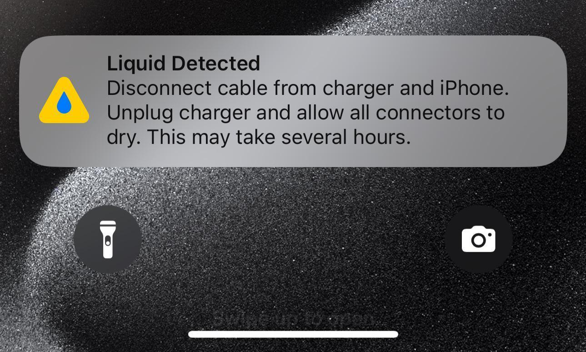

This document provides the additional qualitative examples referenced in our rebuttal to the reviewer pFCg. As stated in the rebuttal:

"We thank the reviewer for the insightful suggestion. The current supplementary file (Table 2) includes several qualitative examples demonstrating modality complementarity. We have now updated the anonymous GitHub repository (linked in the manuscript) with additional cases covering conflicting cues and missing-modality scenarios."

The examples below supplement that statement; the anonymous GitHub repository is linked in the manuscript.

## Conflicting example in CIViL (image and text don't align)

Customer: - can your team let me know why my
new iPhone 6 always has hanging problem I do not know what the problem is by I know I feel I am cheated by apple for phone ?

Support:-
We'd be concerned with an unresponsive device too. Let us know your iS version in DM and we'll help:

Aspect- Quality ; Severity - Blame

## Unimodal examples of the CIViL dataset (image-only)

Aspect- Software ; Severity - No Explicit reproach

## Only-text example

Customer: "My new phone's battery life is terrible and the camera photos are blurry. This is not the premium quality I paid for."

Agent : "I'm sorry to hear about the issues with your camera and battery. Can you confirm if you've tried the basic troubleshooting steps from our website?"

Customer: "Yes, I tried everything on your useless online guide. I think the hardware itself is defective. What is the actual solution?"

Agent: "I apologize that the guide wasn't helpful. Let's schedule a hardware diagnostic at a service center to get this resolved for you."

Aspect  - Hardware ; Severity - Blame

Aspect - Service ; Severity - Disapproval

